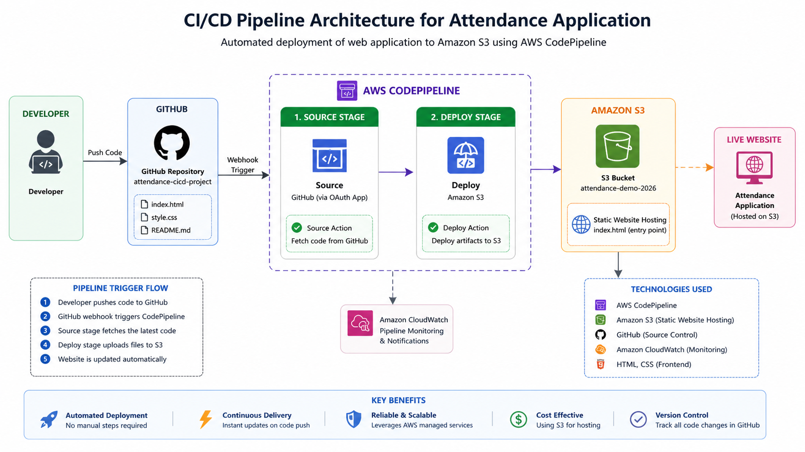
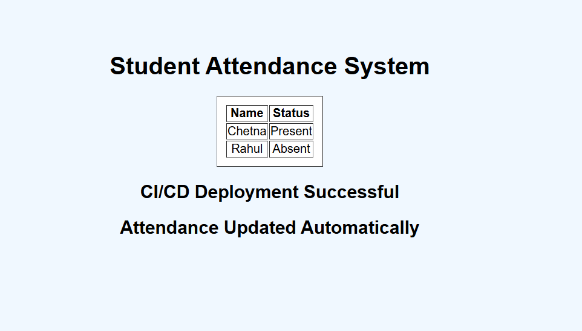
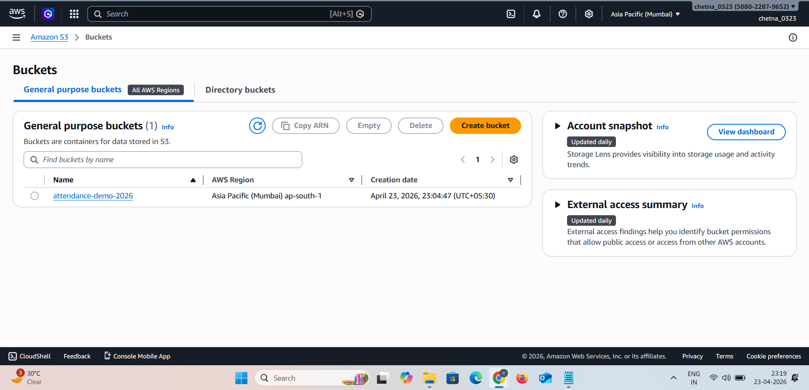
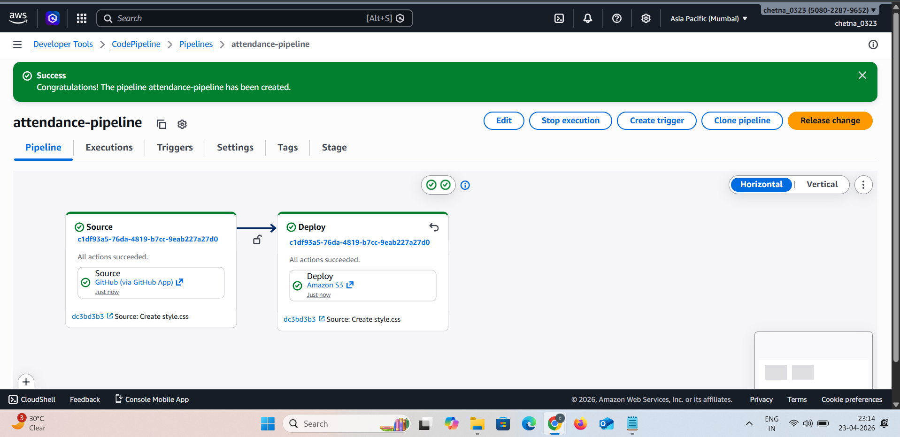
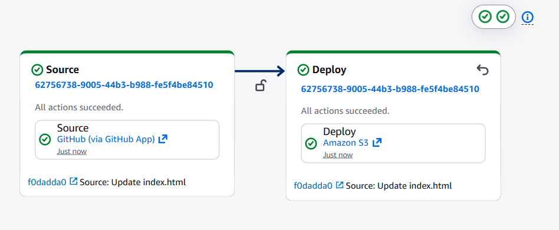

# 🚀 CI/CD Pipeline for Attendance Application


---

📌 Project Overview

This project demonstrates a complete **CI/CD pipeline using AWS services**.
The application is automatically deployed to **Amazon S3** whenever changes are pushed to the GitHub repository.

It eliminates manual deployment and ensures continuous integration and delivery.

---

🧰 Tech Stack

* AWS CodePipeline
* Amazon S3 (Static Website Hosting)
* GitHub (Version Control)
* HTML, CSS

---

🏗️ Architecture Diagram



This architecture shows how GitHub integrates with AWS CodePipeline to automate deployment to Amazon S3.

---

🌐 Live Application Output



This is the final deployed Attendance Application hosted on Amazon S3.
It confirms that the CI/CD pipeline automatically updates the application after every code push.

---

📂 Source Code

🔗 GitHub Repository: https://github.com/chetna0323/CICD-Pipeline-for-Attendance-Application

Any code changes pushed to GitHub automatically trigger the CI/CD pipeline.

---

☁️ Amazon S3 Bucket



The S3 bucket is configured for static website hosting and serves as the deployment destination.

---

⚙️ CI/CD Pipeline Setup



This shows the successful creation of the AWS CodePipeline with GitHub as the source and Amazon S3 as the deployment stage.

---

🔄 Pipeline Execution (Source → Deploy)



This shows a successful pipeline run where code is fetched from GitHub and deployed to Amazon S3 automatically.

---

🔥 Key Features

* Fully automated CI/CD pipeline
* GitHub integration with AWS
* Zero manual deployment
* Real-time updates on code changes
* Static website hosting using S3

---

📁 Project Structure

```
attendance-cicd-project/
│── index.html
│── style.css
│── README.md
│── screenshots/
│    ├── final-output.png
│    ├── s3.png
│    ├── pipeline-setup.png
│    ├── pipeline-execution.png
│    ├── architecture.png
```


---
